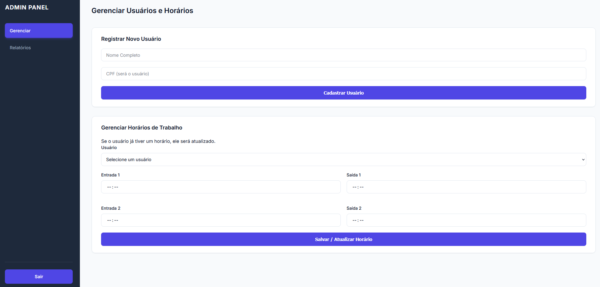

# pontoSimples

Aplicação simples de registro de ponto (para homologação somente) para um melhor controle de entrada e saida de funcionarios


## Instalação e uso:

```bash 
git clone https://github.com/4ybbe/pontoSimples
cd pontoSimples
```

#### Dependencias:
```bash 
pip install Flask pyotp qrcode cryptography openpyxl Pillow
```

Para gerar a chave de criptografia para o banco de dados:
```bash 
python3 generate_key.py 
```

#### Registrando a aplicação no linux (ubuntu server):
```bash
sudo nano /etc/systemd/system/ponto.service
```

```bash
[Unit]
Description=fPonto
After=network.target

[Service]
ExecStart=/usr/bin/python3 /home/com/ponto/app.py
WorkingDirectory=/home/com/ponto/
Restart=always
User=root

[Install]
WantedBy=multi-user.target
```

OBS: Atenção aonde a aplicação esta salva, no exemplo acima esta no diretorio: 

/home/com/ponto/

```bash
# REINICIANDO O SYSTEMCTL PARA APLICAR ALTERAÇÕES
systemctl daemon-reload

# HABILITANDO O SERVIÇO 
systemctl enable ponto

# INICIANDO O SERVIÇO
systemctl start ponto
```
## Uso:

#### Registrando funcionarios:
Acessando o IP da maquina pelo navegador com as credenciais: admin/admiNN. Você consegue registrar o funcionario, preenchendo as informações (nome e cpf), em seguida sera mostrado na tela um QRCODE para o funcionario escanear. O funcionario precisa ter no celular o aplicativo Authenticator (aplicativo OTP do Google) para escanear o QRCODE.
Apos o funcionario escanear o QRCODE, basta voltar para o painel principal para gerenciar os horários de trabalho do funcionario.

#### Registrando ponto:
O usuario para registrar o ponto sera o CPF cadastrado e a senha sera o codigo do aplicativo Authenticator que muda a cada 1 minuto


#### Aba de relatório de ponto:
Aqui sera aonde voce (administrador) podera ver e exportar os registros de cada funcionario cadastrado. Pode ser usado tanto para consulta quanto para exportar o recibo do ponto em si.

## Screenshots
#### Tela de registro de ponto do funcionario:


#### Tela do dashboard do administrador:


## Avisos:
Esse projeto tem o proposito de controlar e gerenciar o registro do ponto dos funcionarios de empresas com menos de 20 funcionarios (aonde não é necessario o registro de ponto).
Caso a empresa tenha mais de 20 funcionarios e você queira implementar essa aplicação, sera necessario passar por diversas exigencias do governo, basta procurar por "REP-P Como funciona"

